# ASSIGNMENT 3
**Name**: Michal Skalican 

## Methods used: 
### GrabCut
**cv2.grabCut** - opencv implementation of the grabCut algorithm<br>

### VOC12 dataset segmentation
**cv2.grabCut** - opencv implementation of the grabCut algorithm<br>
**cv2.floodFill** - opencv implementation of the floodFill algorithm<br>
**cv2.ximgproc.createSuperpixelLSC** - method that returns a SuperpixelLSC object<br>

### Segmentation using background subtraction
**cv2.GaussianBlur** - blurs the image<br>
**cv2.accumulateWeighted** - accumulates the background image<br>
**cv2.threshold** - threshold the difference between background and foreground to get the foreground objects

**cv2.createBackgroundSubtractorMOG2()** - creates a background subtractor object 

### Motion tracking
**cv2.goodFeaturesToTrack** - finds good features to use for motion tracking
**cv2.calcOpticalFlowPyrLK** - calculates the Lucas-Kanade optical flow method

**cv2.calcOpticalFlowFarneback** - 


## GrabCut

The GrabCut algorithm is an algorithm that transforms the image into a graph where each pixel
is a node and the connection between them represents how similar are these pixels in relation to one another. 

The foreground and background are modeled as two "terminal" nodes, and the algorithm aims to minimize 
the cost of a cut through the graph that separates the foreground from the background.

In opencv, it is implemented by the graphCut function.
We pass to the function a mask with 4 distinctive regions - sure foreground, probable foreground, probable background and sure background.
The algorithm figures trough several iterations the best mask to mask out our specified foreground.

```
cv2.grabCut(
    image to segment, 
    initial mask with four regions,
    rectangle to specify ROI,
    initial background model (array of zeros),
    initial foreground model (array of zeros), 
    iterations to perform,
    specify initialization with mask or rectangle
)
```

### GrabCut showcase

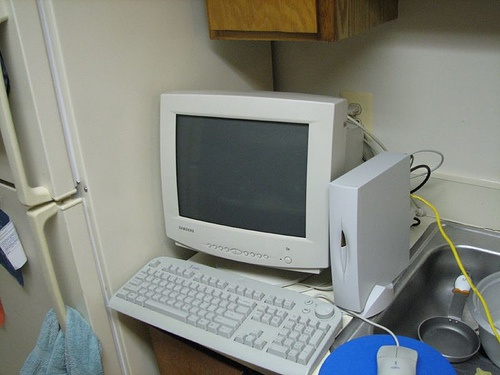<br>
**Original image**

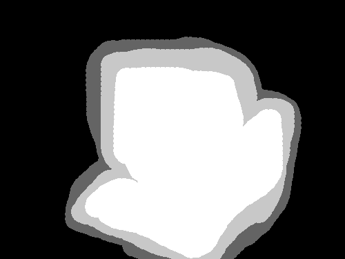<br>
**Hand drawn mask**

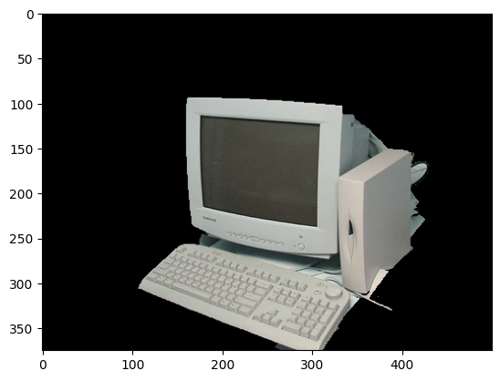<br>
**Final masked out image**

## VOC12 dataset segmentation

To provide the best semiautomatic annotation we combined floodFill, superpixels and grabCut. 
The script for this is in files annotate.py and helper_algos.py. 

First we split the image into superpixels using *cv2.ximgproc.createSuperpixelLSC*. 
After that we draw the superpixel boundaries over the original image. 

The program then shows us 3 images, one is the original image with superpixels, 
one is the mask that is passed into grabcut and the last one is the final mask after using grabcut.
To annotate we choose what type of mask we want to draw by pressing keys 1-4. 

1 - sure foreground <br>
2 - probable foreground <br>
3 - probable background <br>
4 - sure background <br>

On click on the original image, we use floodFill to draw over superpixels that are similar to speed up the process. 
By pressing '+' and '-' we can specify the color range the floodFill should fill up.

To remove unwanted small regions that are hard to select (for example a small patch of sure background where should be sure foreground) we press 'c' to perfrom a closing operation.

On pressing 'd' we compute the dice score against the original annotated image from the dataset.

On pressing 'n' we move to the next image.

### Results

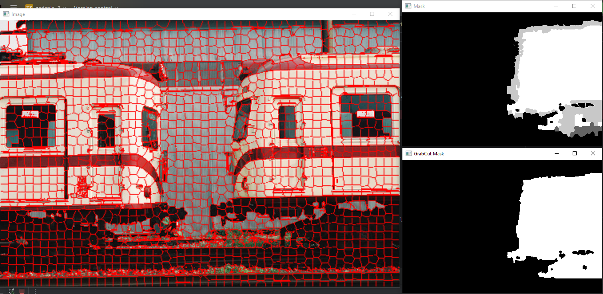<br>
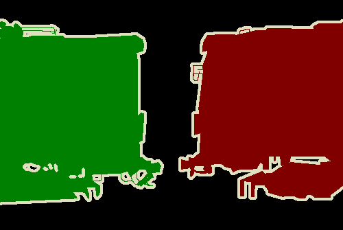<br>
**dice score: 0.95**

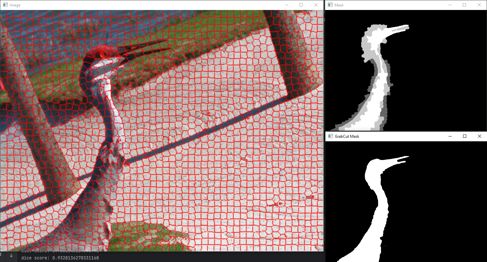<br>
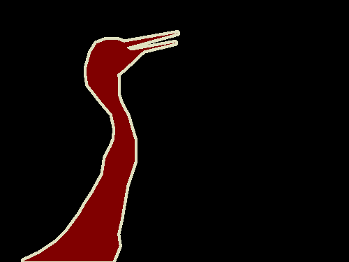<br>
**dice score: 0.93**

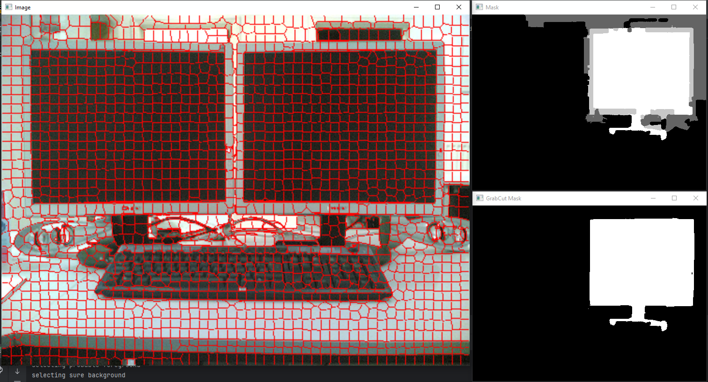<br>
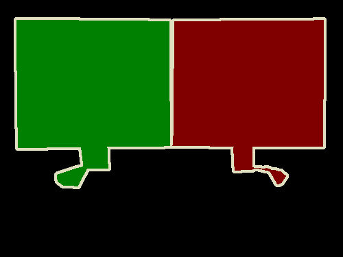<br>
**dice score: 0.98**

## Segmentation using background subtraction

### Accumulate weighted

This method accumulates all the images to figure out the background without any moving objects.
First we get the background, by iterating through the video and accumulate the background using **cv2.accumulateWeighted**.

Then we go to the video once again and get the difference between the background and current frame. 
Using threshold we segment out the moving object for every frame.

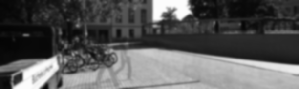<br>
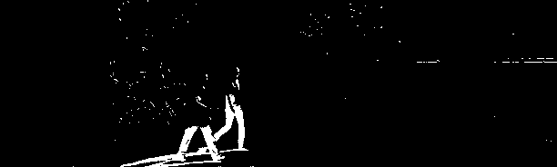<br>


### MOG2

This method uses the gaussian mixture model to separate foreground from background. 
It processes video frames, updating the mixture of Gaussians for each pixel and classifying pixels as either type based on their fit to the model.

Using **cv2.createBackgroundSubtractorMOG2()** we create a background subtractor object. 
Using the apply method, we update the mixture of gaussians with the current frame, using the specified learning rate.
On the gif we can see how the algorithm slowly learns how the background should look, 
and separates repetitive background motion from the foreground motion we want to find.

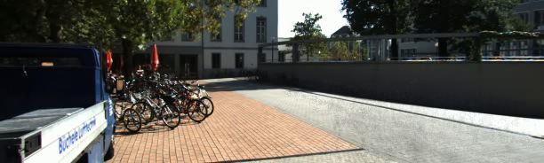<br>
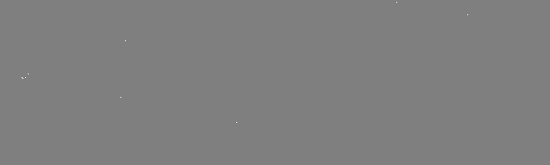<br>


## Motion tracking

### Sparse optical flow
The first step is to calculate features to track. 
This will be done by using the **Shi-Tomasi Corner Detector**. 
In opencv this detector is implemented in the function goodFeaturesToTrack.

```
cv2.goodFeaturesToTrack(
    image, 
    maxCorners=max number of corners, 
    minQuality=minimal quality of corners; minimum possible eigenvalue of a corner
    minDistance=minimal distance between two corners, 
    blockSize=size of an average block for computing a derivative covariation matrix )
```

After finding the features, using Lukas-Kanade method we track their movement.
This is implemented in function **cv2.calcOpticalFlowPyrLK**.

```
cv2.calcOpticalFlowPyrLK(
    image,
    current frame,
    prevPts=features to track,
)
```
**Result**
<br>

### Dense optical flow

Farneback algorithm (**cv2.cv.calcOpticalFlowFarneback**) computes movement for every pixel of the image at multiple resolutions (pyramid). 
The return value is a flow matrix with the same size as the input image, 
where each element of the matrix is a two-channel vector that represents the motion vector of each pixel
from the first image to the second.

The vector is then visualized in HSV space, so every moving object has a different color depending on the direction the object is moving.

```
cv.calcOpticalFlowFarneback(
    previous image,
    next image,
    flow=previous flow,
    pyr_scale=scale of the next image in pyramid,
    level=number of layers in pyramid,
    win_size=averaging window size,
    iterations,
    poly_n=pixel neighborhood used to find polynomial expansion in each pixel,
    poly_sigma=sigma of the Gaussian that is used to smooth derivatives,
    flags
)
```

**Result**
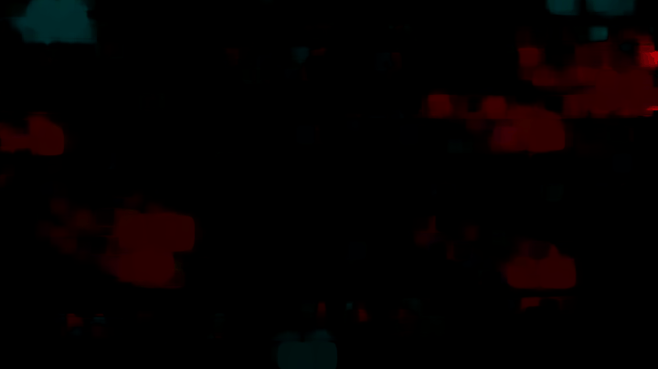<br>


